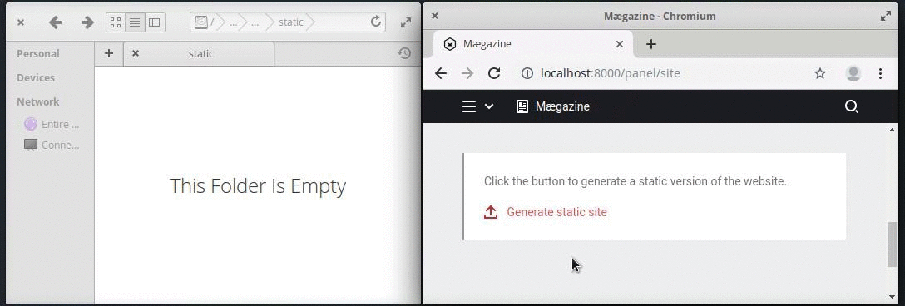

# Kirby 3 - Static Site Generator

With this plugin you can create a directory with assets, media and static html files generated from your pages. You can simply upload the generated files to any CDN and everything (with small exceptions, see below) will still work. The result is an even faster site with less potential vulnerabilities.

## What works
- Compatibility with multilanguage sites
- Translated URLs
- Assets
- Media
- Customizable base URL
- Customizable paths to copy
- Customizable output folder
- Preserve individual files / folders in the output folder

## What doesn't work
- Custom routes
- Query parameters (unless processed by javascript)
- Directly opening the html files in the browser with the file protocol (absolute base url `/`)

## Example


## How to use it

### 1) Directly (e.g. from a kirby hook)

```php
$staticSiteGenerator = new D4L\StaticSiteGenerator($kirby, $pathsToCopy = null);
$fileList = $staticSiteGenerator->generate($outputFolder = './static', $baseUrl = '/', $preserve = []);
```
- `$pathsToCopy`: if not given, `$kirby->roots()->assets()` and `$kirby->roots()->media()` are used; set to `[]` to skip copying files
- use `$preserve` to preserve individual files or folders in your output folder, e.g. if the folder is a git repository, set `$preserve`to `['.git']`; also useful to preserve for example a favicon directly in the root of the output folder

### 2) By triggering an endpoint
To use this, adapt config option `d4l.static_site_generator.endpoint` to your needs (should be a string)

### 3) By using a `static-site-generator` field
Do the same as for option 2) and then add a `staticSiteGenerator` type field to one of your blueprints:
```yaml
fields:
  staticSiteGenerator:
    label: Generate a static version of the site
    # ... (see "Field options")
```

## Available configuration options

```php
return [
    'd4l' => [
      'static_site_generator' => [
        'endpoint' => null, # set to a string to use the built-in webhook, e.g. when using the blueprint field
        'output_folder' => './static', # you can specify an absolute or relative path
        'base_url' => '/', # if the static site is not mounted to the root folder of your domain, change accordingly here
      ]
    ]
];
```
All of these options are only relevant if you use implementation options 2) or 3).
When directly using the `D4L\StaticSiteGenerator` class, no config options are required.

## Field options

```yaml
label: Generate static site
help: Custom help text
progress: Custom please-wait message
success: Custom success message
error: Custom error message
```

## Warnings
Be very careful when specifying the output folder, as the given path will be erased before the generation!

Feedback and contributions are welcome!
